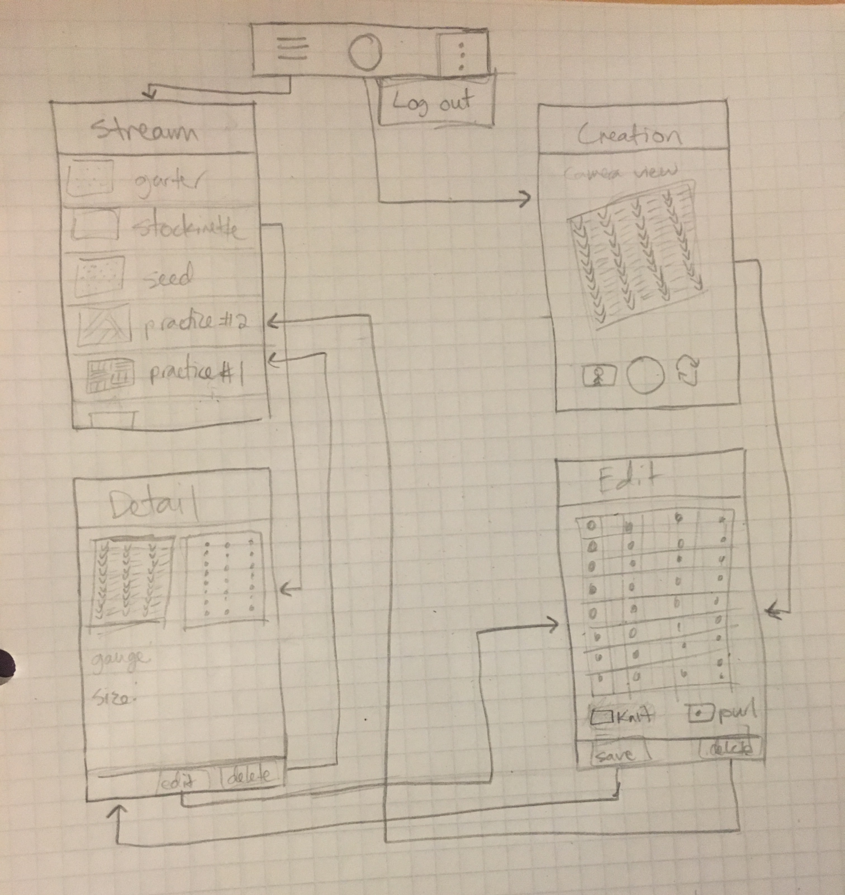

Original App Design Project - README Template [New]
===

# APP_NAME_HERE

## Table of Contents
1. [Overview](#Overview)
1. [Product Spec](#Product-Spec)
1. [Wireframes](#Wireframes)
2. [Schema](#Schema)

## Overview
### Description
Determines knitting patterns based on a knitted product.

### App Evaluation
[Evaluation of your app across the following attributes]
- **Category:** Personal organizer?
- **Mobile:** The mobile platform lets the user easily take pictures of the knitted item.
- **Story:** Lets the user either take a picture or use a picture of a knitted product, from which a pattern is determined and displayed for the user to use.
- **Market:** Textile artists, primarily beginners since the first version of this app with deal with relatively simple patterns, and it is less likely that advanced knitters will have these issues.
- **Habit:** Rewards for finishing patterns?
- **Scope:** V1 lets the user take/pic a photo of a simple (knit/purl only) pattern and the pattern is saved. There will be a list view where the user can see their patterns. V2 will allow more complex patterns and overlay the pattern over the image.

## Product Spec

### 1. User Stories (Required and Optional)

**Required Must-have Stories**

* User can login
* User can sign up
* User can log out
* User can take/select a photo
* User can see information about the image and pattern
* User can save an image/pattern pair
* User can view previously saved patterns

**Optional Nice-to-have Stories**

* User can modify pattern
    * Edit mistakes made while the image was being processed
* Pattern is shown as an overlay to the image
    * Visibility can be selected
* User can switch from camera view to pattern view by swiping left

### 2. Screen Archetypes

* Login/registration screen
   * User can login
   * User can sign up
* Camera screen
   * User can take/select a photo
* List view
    * User can view previously saved patterns
* Detail view
    * User can see information about the image and pattern

### 3. Navigation

**Tab Navigation** (Tab to Screen)

* Logout button (not necessarily a screen)
* Pattern list
* Camera view

**Flow Navigation** (Screen to Screen)

* Login/signup
   => Camera view
* Camera view
   => Detail view (after taking picture)
* Pattern list
   => Detail view

## Wireframes

### [BONUS] Digital Wireframes & Mockups

### [BONUS] Interactive Prototype

## Schema 
[This section will be completed in Unit 9]
### Models
#### Pattern

   | Property      | Type     | Description |
   | ------------- | -------- | ------------|
   | objectId      | String   | unique id for the user post (default field) |
   | user          | Pointer to User| current user |
   | image         | File     | image of swatch |
   | pattern       | Array    | 2D boolean array of pattern |
   | name          | String   | name the user gives to the pattern |
   | createdAt     | DateTime | date when post is created (default field) |
   | updatedAt     | DateTime | date when post is last updated (default field) |
   
### Networking
#### List of network requests by screen
   - Home Feed Screen
      - (Read/GET) Query all patterns made by the current user
   - Create Pattern Screen
      - (Create/POST) Create a new Pattern object
   - Detail Screen
      - (Read/GET) Query for specific pattern info
      - (delete) Delete current pattern
   - Edit Screen
      - (Update/PUT) Update pattern array
      - (delete) Delete current pattern
- [Create basic snippets for each Parse network request]
- [OPTIONAL: List endpoints if using existing API such as Yelp]
